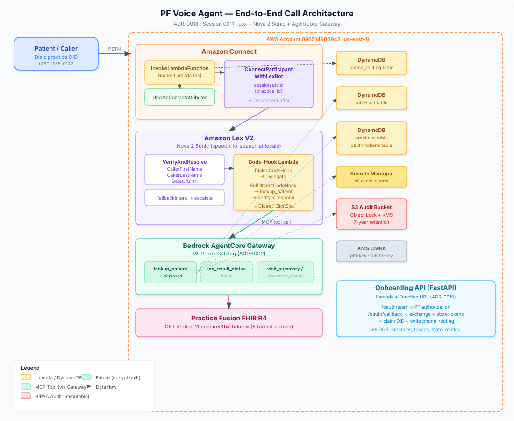

# FHIR Voice Agent — AWS Reference Architecture

AWS-native voice agent that verifies patient identity over the phone, integrated with an EHR's FHIR R4 endpoint via SMART-on-FHIR OAuth. **Amazon Connect** handles telephony; **Lex V2 + Nova 2 Sonic** handles speech-to-speech; a **Lambda code-hook** calls **Claude (Bedrock)** every turn for natural conversation; **Lambda tools** query the practice's FHIR endpoint to match the caller against EHR records. Built for Practice Fusion but the patterns generalize to any FHIR-enabled EHR.

## Architecture



```
DID → Connect contact flow
       → InvokeLambdaFunction (router) → phone_routing by DID → returns practice ID
       → ConnectParticipantWithLexBot (Lex bot; Nova 2 Sonic)
            → FallbackIntent → code-hook Lambda (every turn)
            → Code-hook calls Claude (Bedrock InvokeModel) with verification prompt
            → Claude reasons, requests tool calls → code-hook executes them
            → Code-hook returns Claude's response → Nova Sonic speaks it → loop
       → Close → contact flow routes to queue or disconnects
```

## What you'll learn

| Pattern | Where |
|---------|-------|
| **SMART-on-FHIR OAuth** (Provider App, PKCE, refresh tokens, KMS-encrypted token store) | `oauth/` |
| **FHIR resource querying** with allowlists + voice-safe projections | `tools/fhir_query/` |
| **Patient lookup** by phone/name/DOB with multi-format phone normalization | `tools/lookup_patient/` |
| **LLM-powered voice agent** via Lex code-hook + Bedrock Claude | `tools/lex_code_hook/` |
| **HIPAA audit logging** + per-practice rate limiting | `audit/` |
| **Multi-tenant phone routing** (DID → practice) | `routing/` |
| **AWS CDK for healthcare** (Connect, Lex, Lambda, DynamoDB, KMS, S3) | `infra/` |

## Quickstart

Prerequisites:
- Python 3.12
- Node 22
- AWS CLI v2 (SSO-authenticated to your account, region `us-east-1`)
- AWS CDK v2 (`npm i -g aws-cdk`)

```bash
make bootstrap   # install Python + Node dependencies
make test        # run all tests (pytest + jest + CDK snapshot tests)
make lint        # ruff + tsc --noEmit
make synth       # synthesize CDK CloudFormation templates
```

## Layout

| Path | Purpose |
|---|---|
| [`tools/lex_code_hook/`](tools/lex_code_hook/) | Lex code-hook Lambda — LLM agent loop (Claude via Bedrock). Prompts in `src/lex_code_hook/prompts/` |
| [`tools/lookup_patient/`](tools/lookup_patient/) | FHIR Patient search by phone/name/DOB |
| [`tools/fhir_query/`](tools/fhir_query/) | Generic FHIR query tool — Claude composes queries, code enforces allowlists + projections |
| [`tools/router_lookup/`](tools/router_lookup/) | DID → practice routing (DynamoDB) |
| [`oauth/`](oauth/) | SMART-on-FHIR OAuth onboarding service (FastAPI on Lambda) |
| [`api/`](api/) | Practice dashboard API (FastAPI) |
| [`routing/`](routing/) | Phone routing store + Connect DID provisioner |
| [`audit/`](audit/) | HIPAA PHI disclosure logging + rate limiting |
| [`infra/`](infra/) | AWS CDK app (TypeScript) — Connect, Lex, Lambda, DynamoDB, S3, KMS |
| [`docs/`](docs/) | Architecture, credentials guide, glossary, ADRs, roadmap |
| [`scripts/`](scripts/) | FHIR exploration utilities |

## Key docs

- [`docs/architecture.md`](docs/architecture.md) — Full system architecture and data flows
- [`docs/credentials.md`](docs/credentials.md) — Secrets management for HIPAA compliance
- [`docs/glossary.md`](docs/glossary.md) — FHIR, SMART, and AWS terminology
- [`docs/decisions/`](docs/decisions/) — Architecture Decision Records
- [`docs/roadmap.md`](docs/roadmap.md) — Development roadmap and phasing
- [`CLAUDE.md`](CLAUDE.md) — Development conventions and package map

## Status

Pre-pilot. One practice, Phase 1 (verification + three read-only FHIR use cases).

## License

[MIT](LICENSE)
