# User Journeys & System Behavior

> **Purpose:** This document works backward from real people with real
> problems. Every architectural choice, every edge case handler, every
> error message exists because a specific person in a specific situation
> needs a specific outcome. Read this before deploying anything.

---

## Part 1: The People

### Maria Rodriguez — Practice Office Manager

**Practice:** Sunshine Family Medicine, 3 providers, suburban Phoenix.
**Her day:** Arrives at 7:30am. By 8:15 the phone is ringing nonstop.
Two front-desk staff handle ~120 inbound calls/day. By 10am both lines
are occupied and calls roll to voicemail. She checks the voicemail queue
at lunch — 14 messages, 6 are patients asking "are my labs back?"

**Her problem:** She's losing patients. The NPS survey she ran last quarter
had "can never reach the office by phone" as the #1 complaint. She's
calculated that ~40% of inbound calls are identity verification + a simple
status question that could be answered in 30 seconds if a human didn't
have to do the verification step first. That's ~48 calls/day × 2.5 minutes
of staff time = **2 hours/day of staff time** on verification alone.

**What she wants:** "Something that picks up the phone instantly, verifies
who they are, and either answers their question or gets them to the right
person. I don't want patients sitting on hold."

**What success looks like for Maria:**
- 80%+ of lab-status and document-status calls fully resolved without
  human pickup (saves ~1.5 hours/day of staff time)
- Zero calls abandoned in the verification queue
- Dashboard showing call outcomes so she can report to the providers

---

### Sarah Chen — Front Desk Receptionist

**Her day:** Answers the phone, verifies callers ("Can I get your name and
date of birth?"), looks up the patient in PF, routes or answers. Repeats
80-100 times a day. When she's on a call, the other line rings. When both
lines are busy, the third call goes to voicemail. She feels personally
responsible when patients can't get through.

**Her problem:** Verification is mechanical but unavoidable. She asks the
same three questions, types the same search, confirms the same match.
It takes 90-120 seconds per call before she can even start helping.
Meanwhile the second line is ringing.

**What she wants:** "If the robot can do the verification part and the
simple questions, I can focus on the calls that actually need me —
scheduling changes, insurance questions, upset patients."

**What success looks like for Sarah:**
- Calls that reach her are already verified — patient context is attached
- She never handles a "are my labs back?" call again
- When the AI can't help, it transfers the call with context (not a cold transfer)

---

### James Wilson — Patient / Caller

**His situation:** Had blood drawn at Sunshine Family Medicine 4 days ago.
Dr. Patel said "results in 3-5 days, we'll call you." It's day 4. He's
anxious. He calls the practice.

**His problem:** He calls. It rings. And rings. Voicemail. He calls back
an hour later. Sarah answers, asks his name, date of birth, puts him on
hold while she looks him up. Comes back: "Your labs are complete, the
doctor has reviewed them, you should hear from us in the next day or two."
Total time: 4 minutes. But 3 of those minutes were verification and hold
time. And the first call didn't get through at all.

**What he wants:** Call → identify himself → get an answer → hang up.
Under 60 seconds. No hold. No voicemail.

**What success looks like for James:**
- Phone is answered immediately (no ring-and-wait)
- Verification takes 20 seconds, not 90
- Gets a definitive answer: "Your labs from May 20th are complete.
  Dr. Patel has reviewed them. The office will contact you within 2
  business days."
- If the AI can't help, he's transferred to a human who already knows
  who he is

---

### Dr. Priya Patel — Authorizing Clinician

**Her role:** Senior provider at Sunshine Family Medicine. Maria asked her
to approve "some new phone system." She has 5 minutes between patients.

**Her problem:** She doesn't have a problem — Maria does. Priya's job is
to click the button that authorizes the system to read patient records on
her behalf. She needs to understand what she's authorizing, do it fast,
and never think about it again.

**What she wants:** "Tell me what I'm approving, show me where to click,
and don't make me do it again."

**What success looks like for Dr. Patel:**
- One-time authorization takes < 2 minutes
- She understands what data the system can access (read-only patient
  demographics, lab statuses, visit summaries, document statuses)
- She never needs to re-authorize unless she explicitly revokes

---

## Part 2: Practice Onboarding Journey

### The story

Maria finds us through Veradigm's partner directory (or our sales team
reaches out). She signs up. Here's what happens from her perspective and
from the system's perspective, step by step.

### Visual: Onboarding Flow

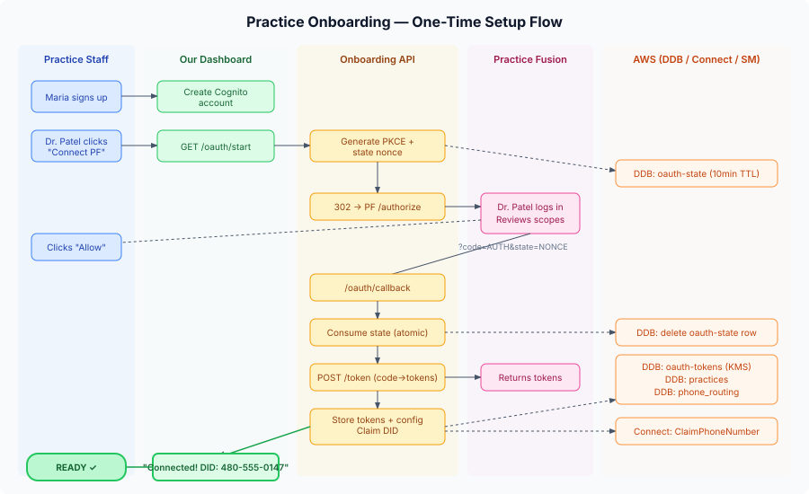

### Sequence: Onboarding

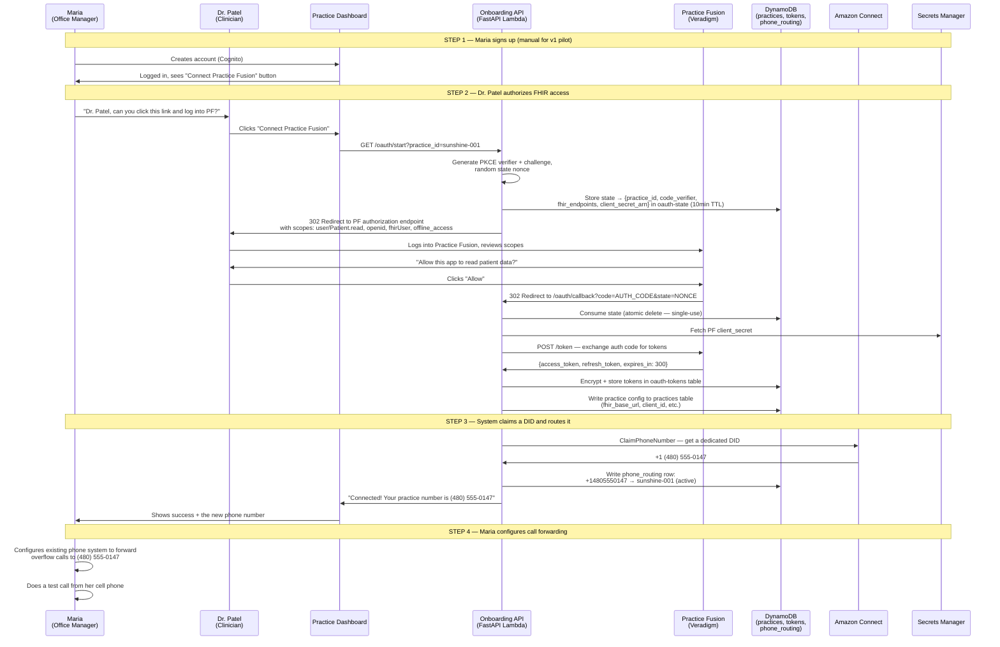

### What Maria sees at each step

| Step | Maria's experience | System action | Time |
|---|---|---|---|
| 1. Sign up | Fills out practice name, contact info, creates password | Cognito user pool entry created | 2 min |
| 2. Connect PF | Hands laptop to Dr. Patel: "Log into PF and click Allow" | OAuth authorization_code + PKCE flow; stores encrypted refresh token | 90 sec |
| 3. Get number | Sees "Connected! Your number is (480) 555-0147" | DID claimed from Connect pool; phone_routing row written | 5 sec |
| 4. Forward calls | Configures her existing phone system (Vonage, RingCentral, etc.) to forward to the new DID | Nothing on our side — this is her phone vendor's config | 5-15 min |
| 5. Test call | Calls from her cell, hears the AI greeting | Full call flow executes end-to-end | 1 min |

### Onboarding edge cases

| Scenario | What happens | User experience |
|---|---|---|
| Dr. Patel clicks "Deny" on PF consent screen | PF redirects with `error=access_denied`; callback returns a friendly error | Dashboard shows "Authorization was not granted. Please try again." |
| OAuth state expires (> 10 min between start and callback) | State row TTL-evicted; callback can't find it | "Your session expired. Please click Connect again." |
| Dr. Patel's PF account doesn't have sufficient privileges | PF returns a scope error at token exchange | "Practice Fusion returned an error. Please ensure the authorizing provider has full patient access." |
| DID pool exhausted in the Connect region | `ClaimPhoneNumber` fails | "We couldn't assign a phone number right now. Our team has been notified." (alert fires) |
| Practice tries to onboard twice | Idempotent — same practice_id gets same DID back | No error; dashboard shows existing connection |
| Network failure during token exchange | API returns 502; state is consumed (single-use) | "Something went wrong. Please click Connect again." (state is gone, so retry generates fresh state) |

---

## Part 3: The Patient Call

### Journey A: Happy Path — James calls about lab results

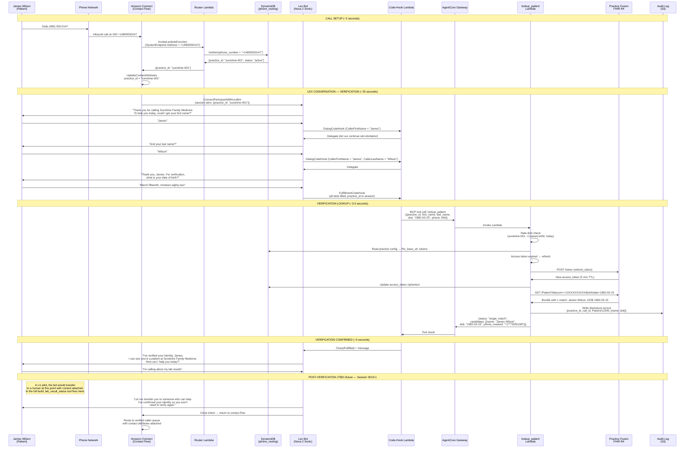

### What James experiences (timeline)

| Time | James hears/does | What's happening behind the scenes |
|---|---|---|
| 0:00 | Dials (480) 555-0147 | Phone network routes to Connect |
| 0:02 | Phone connects (no ringing) | Router Lambda resolves DID → practice_id in ~50ms |
| 0:03 | "Thank you for calling Sunshine Family Medicine..." | Lex bot (Nova 2 Sonic) begins conversation |
| 0:05 | "Could I get your first name?" | Lex eliciting CallerFirstName slot |
| 0:07 | "James" | Speech-to-text via Nova 2 Sonic |
| 0:08 | "And your last name?" | Dialog code hook delegates back to Lex |
| 0:10 | "Wilson" | |
| 0:11 | "What is your date of birth?" | |
| 0:14 | "March fifteenth, nineteen eighty-two" | Nova Sonic interprets natural date speech |
| 0:15 | Brief pause | Fulfillment hook fires, calls lookup_patient via Gateway |
| 0:18 | "I've verified your identity, James." | Single match found, verified |
| 0:22 | "How can I help you today?" | |
| 0:25 | "I'm calling about my lab results" | |
| 0:28 | Answer or transfer | Future: lab_result_status tool. v1: warm transfer |

**Total verification time: ~18 seconds** (vs. 90-120 seconds with Sarah)

---

### Journey B: Edge Cases — Everything That Can Go Wrong

#### B1: No patient match found

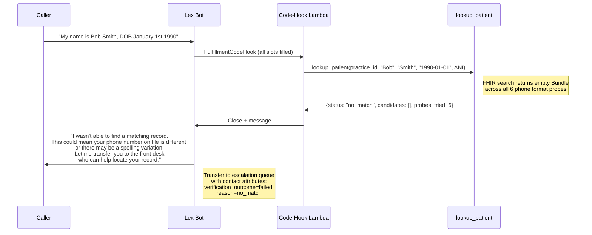

**Why this happens:**
- Patient's phone number in PF doesn't match their caller ID (ported number, calling from work, spouse's phone)
- Name spelling mismatch ("Bob" vs "Robert", "MacDonald" vs "McDonald")
- Patient isn't actually a patient at this practice
- DOB entered incorrectly by the practice originally

**Maria's dashboard shows:** `Call from +1***5550199 | Verification: FAILED (no_match) | Transferred to front desk | Duration: 0:35`

---

#### B2: Multiple matches — disambiguation needed

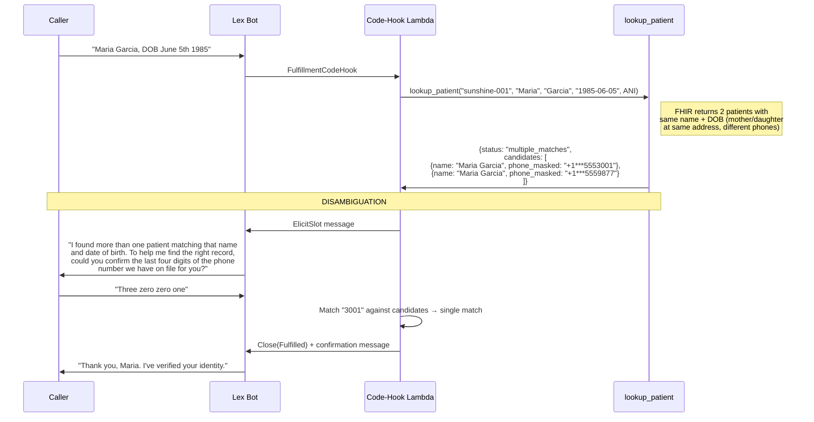

**Why this happens:**
- Common name + DOB collision (more frequent in larger practices)
- Family members with similar names at the same practice
- Data entry duplicates in PF

**If disambiguation fails** (caller can't confirm phone digits, or both candidates have the same last-4):
Transfer to human with `verification_outcome=failed, reason=ambiguous`.

---

#### B3: Wrong number / unregistered DID

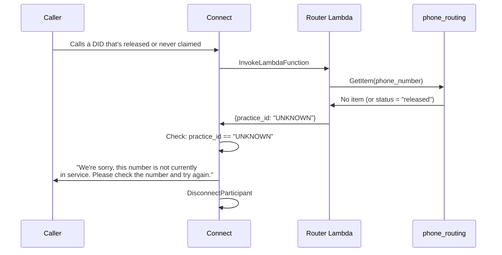

**Why this happens:**
- Caller misdialed
- Practice offboarded and DID was released
- DID was claimed but practice hasn't configured forwarding yet

---

#### B4: OAuth token expired / refresh token revoked

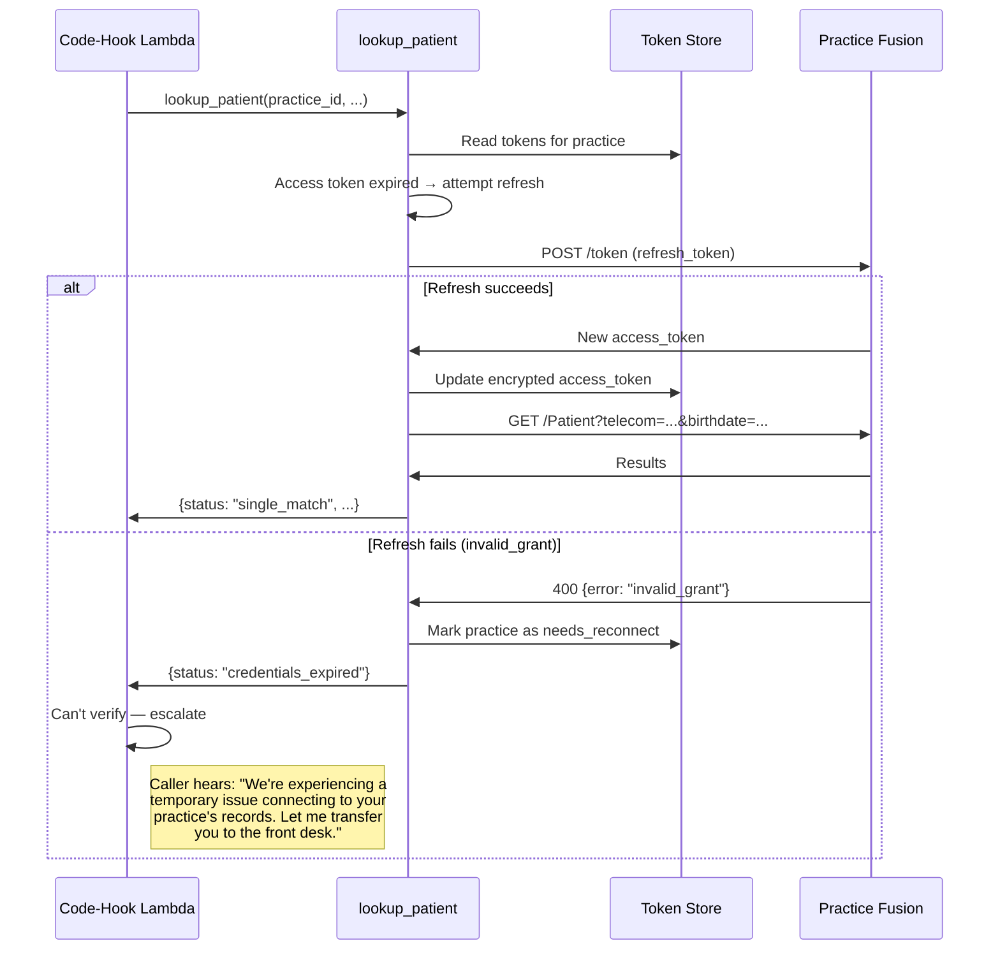

**Why refresh tokens die:**
- Authorizing clinician (Dr. Patel) leaves the practice
- Practice Fusion revokes the app's access
- Token naturally expires (PF refresh token TTL — currently appears indefinite but not guaranteed)

**What Maria sees on the dashboard:** Alert banner: "Practice Fusion connection lost. A provider needs to re-authorize. [Reconnect →]"

**What the on-call alarm fires:** CloudWatch alarm on `credentials_expired` count > 0 → SNS notification.

---

#### B5: Rate limit exceeded

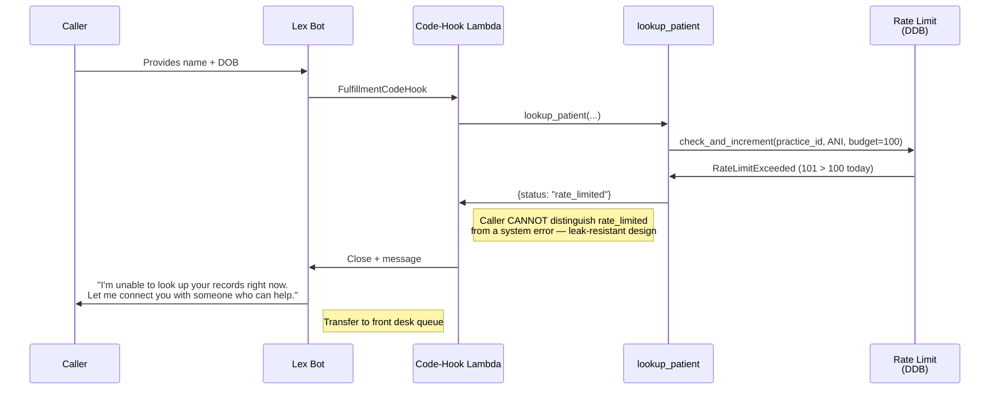

**Why this matters:**
- Prevents a single phone number from querying patient records 1000× a day
- Thwarts social-engineering attacks (try many DOBs against one phone)
- Budget is 100 calls/day per (practice, ANI) — one legitimate patient never hits this

**What Maria sees:** Nothing unless it's a real attack. Rate-limit events show up in the operations dashboard for security review.

---

#### B6: Call drops mid-conversation

| Drop point | What happens | Data state |
|---|---|---|
| During router Lambda | Connect detects disconnect → flow ends | No state written; no PHI accessed |
| During Lex slot collection (before verification) | Lex session ends → no fulfillment hook fires | No FHIR call made; no PHI accessed; no audit record needed |
| During lookup_patient (FHIR call in flight) | Lambda completes (async from call); audit record written for the FHIR probe | Disclosure record exists in S3 audit log (correct — we did access PHI) |
| After verification, during transfer | Call drops before reaching human queue | Calls table records verification_outcome=verified but no agent pickup; transcript preserved |
| After verification, during JTBD answer | Caller heard partial answer; call ends | Audit record for the FHIR read exists; call outcome = hung_up |

**Key invariant:** If we accessed PHI (made a FHIR call), the audit record exists regardless of whether the call completed. The audit log is written synchronously before the result is returned.

---

#### B7: Caller asks for a human at any point

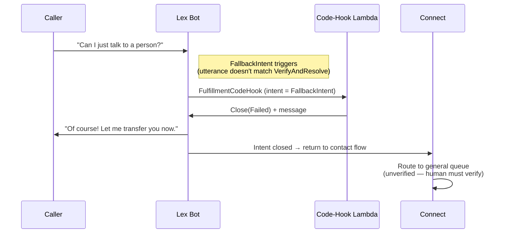

**Caller utterances that should trigger escalation:**
- "Talk to a person" / "speak to someone" / "representative" / "human"
- "I don't want to talk to a robot"
- Repeated failures (3 attempts to collect a slot → Lex gives up)
- Silence (Lex input timeout → InputTimeLimitExceeded error → disconnect or transfer)

---

#### B8: Practice Fusion FHIR endpoint is down

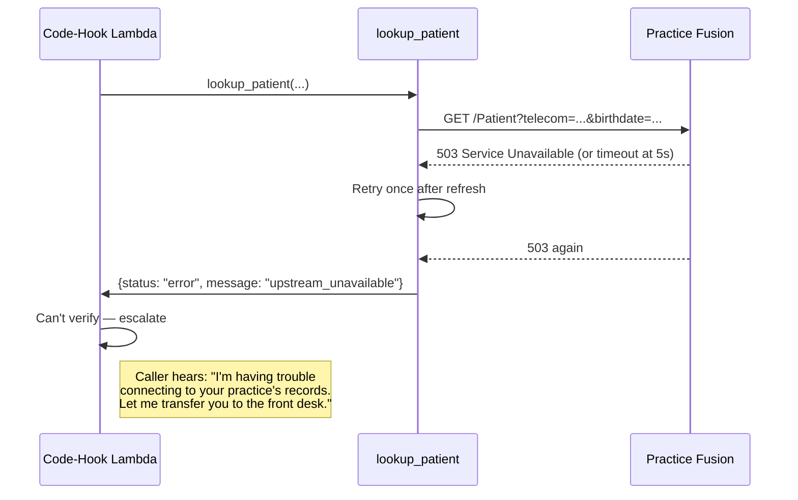

**What happens to other callers:** Every call to this practice fails until PF recovers. The `error` status is not practice-specific — it could be PF-wide. CloudWatch alarm fires on error rate > 5% across all practices.

---

#### B9: After-hours call

| Time | Behavior |
|---|---|
| During business hours (per `practices.business_hours`) | Full conversation: verify + resolve or transfer |
| After hours, practice has after-hours config | "Thank you for calling Sunshine Family Medicine. Our office is currently closed. Our hours are Monday through Friday, 8am to 5pm. If this is a medical emergency, please hang up and dial 911. Otherwise, please call back during business hours." → Disconnect |
| After hours, no config | Same as during hours (practice chose 24/7 availability) |

**Note:** After-hours handling is a contact-flow-level decision, not a Lex decision. The router Lambda can return business_hours info, and the contact flow can branch before reaching Lex.

---

## Part 4: System Architecture

### High-level view


### Call state machine

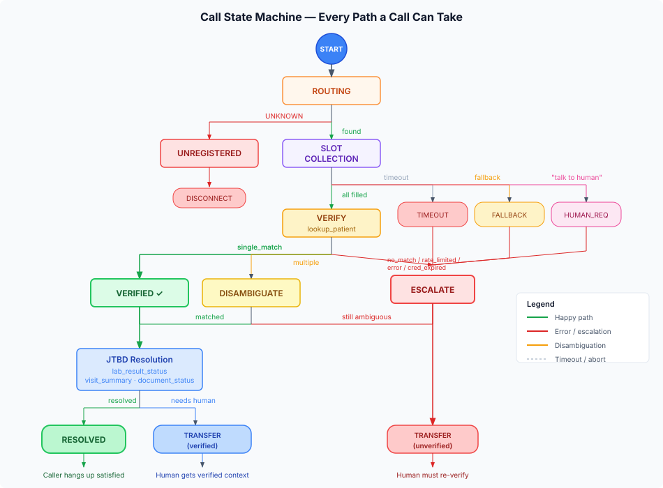

```
┌─────────────────────────────────────────────────────────────────────────┐
│                           CALLER'S PHONE                                │
│  James dials (480) 555-0147                                             │
└─────────────────────┬───────────────────────────────────────────────────┘
                      │ PSTN
                      ▼
┌─────────────────────────────────────────────────────────────────────────┐
│  AMAZON CONNECT                                                         │
│  ┌──────────────────────────────────────────────────────────────────┐   │
│  │  Contact Flow                                                    │   │
│  │                                                                  │   │
│  │  ┌──────────────────┐   ┌─────────────────────┐                 │   │
│  │  │ InvokeLambda     │──▶│ UpdateContact        │                 │   │
│  │  │ (Router)         │   │ Attributes           │                 │   │
│  │  │                  │   │ (practice_id)        │                 │   │
│  │  └────────┬─────────┘   └──────────┬──────────┘                 │   │
│  │           │                        │                             │   │
│  │           ▼                        ▼                             │   │
│  │  ┌────────────────┐   ┌──────────────────────────┐              │   │
│  │  │ phone_routing   │   │ ConnectParticipant       │              │   │
│  │  │ DDB table       │   │ WithLexBot               │──────┐      │   │
│  │  └────────────────┘   └──────────────────────────┘      │      │   │
│  └──────────────────────────────────────────────────────────┼──────┘   │
└─────────────────────────────────────────────────────────────┼──────────┘
                                                              │
                      ┌───────────────────────────────────────┘
                      ▼
┌─────────────────────────────────────────────────────────────────────────┐
│  AMAZON LEX V2  (Nova 2 Sonic speech-to-speech at locale level)        │
│                                                                         │
│  Intent: VerifyAndResolve                                               │
│  Slots: CallerFirstName, CallerLastName, DateOfBirth                    │
│                                                                         │
│  ┌──────────────────────────────────────────────────────────────────┐   │
│  │  Code-Hook Lambda (dialog + fulfillment)                         │   │
│  │                                                                  │   │
│  │  DialogCodeHook → Delegate (let Lex drive slot collection)       │   │
│  │  FulfillmentCodeHook → Call lookup_patient via Gateway           │   │
│  │                      → Interpret results                         │   │
│  │                      → Close(Fulfilled) or Close(Failed)         │   │
│  └────────────────────────────────┬─────────────────────────────────┘   │
└───────────────────────────────────┼─────────────────────────────────────┘
                                    │ MCP tool call
                                    ▼
┌─────────────────────────────────────────────────────────────────────────┐
│  BEDROCK AGENTCORE GATEWAY  (MCP tool catalog)                          │
│                                                                         │
│  ┌─────────────────┐ ┌─────────────────┐ ┌──────────────────┐          │
│  │ lookup_patient   │ │ lab_result_     │ │ visit_summary    │ ...      │
│  │ Lambda           │ │ status Lambda   │ │ Lambda           │          │
│  └────────┬────────┘ └─────────────────┘ └──────────────────┘          │
└───────────┼─────────────────────────────────────────────────────────────┘
            │
            │  Per-call: rate limit → credential resolve → FHIR call → audit log
            ▼
┌─────────────────────────────────────────────────────────────────────────┐
│  PRACTICE FUSION FHIR R4                                                │
│  GET /Patient?telecom={phone}&birthdate={dob}                           │
│  (6 phone format probes per ADR-0006)                                   │
└─────────────────────────────────────────────────────────────────────────┘
```

### Detailed component diagram

```
┌──────────────────────── AWS Account 086514900943 (us-east-1) ────────────────────────┐
│                                                                                       │
│  ┌─── CDK Stack: audit ──────┐  ┌─── CDK Stack: rate-limit ──┐                      │
│  │  S3 Bucket (Object Lock)  │  │  DDB: rate-limit (TTL)     │                      │
│  │  KMS CMK (phi-key)        │  │  PAY_PER_REQUEST            │                      │
│  └───────────────────────────┘  └─────────────────────────────┘                      │
│                                                                                       │
│  ┌─── CDK Stack: phone-routing ──┐  ┌─── CDK Stack: agent-gateway ───────────────┐  │
│  │  DDB: phone-routing           │  │  AgentCore Gateway                          │  │
│  │  (phone_number → practice_id) │  │  └─ Target: lookup_patient (Lambda)         │  │
│  └───────────────────────────────┘  │     └─ tool_schema.json                     │  │
│                                      │  └─ Target: lab_result_status (future)      │  │
│                                      │  └─ Target: visit_summary (future)          │  │
│                                      │  └─ Target: document_status (future)        │  │
│                                      └────────────────────────────────────────────┘  │
│                                                                                       │
│  ┌─── CDK Stack: lex ────────────────────────────────────────────────────────────┐   │
│  │  Lex V2 Bot (Nova 2 Sonic at en_US locale)                                    │   │
│  │  ├─ Intent: VerifyAndResolve (3 slots + dialog/fulfillment hooks)             │   │
│  │  ├─ Intent: FallbackIntent                                                    │   │
│  │  ├─ BotVersion → BotAlias (code-hook Lambda attached)                         │   │
│  │  │                                                                             │   │
│  │  Code-Hook Lambda (Python 3.12, ARM64)                                         │   │
│  │  └─ Packages: lex_code_hook, lookup_patient, oauth, audit, routing             │   │
│  │  IAM: Lex bot role → bedrock:InvokeModelWithBidirectionalStream (Nova 2 Sonic) │   │
│  └────────────────────────────────────────────────────────────────────────────────┘   │
│                                                                                       │
│  ┌─── CDK Stack: connect ────────────────────────────────────────────────────────┐   │
│  │  Connect Instance (CONNECT_MANAGED, inbound only)                              │   │
│  │  Contact Flow:                                                                 │   │
│  │    InvokeLambdaFunction(router) → UpdateContactAttributes → LexBot → Disconnect│   │
│  │  Router Lambda (Python 3.12, ARM64, 5s timeout)                                │   │
│  │  └─ IAM: dynamodb:GetItem on phone_routing                                    │   │
│  └────────────────────────────────────────────────────────────────────────────────┘   │
│                                                                                       │
│  ┌─── CDK Stack: api ───────────────────────────────────────────────────────────┐    │
│  │  Onboarding API Lambda (FastAPI + Mangum, Function URL)                       │    │
│  │  ├─ GET /oauth/start → redirect to PF authorization                           │    │
│  │  ├─ GET /oauth/callback → exchange code, store tokens, claim DID              │    │
│  │  └─ GET /healthz                                                              │    │
│  │  DDB tables: practices, oauth-tokens, oauth-state                             │    │
│  │  Secrets Manager: pf-client-secret                                            │    │
│  └───────────────────────────────────────────────────────────────────────────────┘    │
│                                                                                       │
└───────────────────────────────────────────────────────────────────────────────────────┘
```

---

## Part 5: The Complete Call State Machine

Every call transitions through these states. No call skips a state. No
state has an unhandled exit.

```
                    ┌──────────────┐
                    │  CALL_START  │
                    └──────┬───────┘
                           │
                    ┌──────▼───────┐
                    │    ROUTING   │ Router Lambda resolves DID
                    └──────┬───────┘
                           │
               ┌───────────┼───────────┐
               │                       │
        practice_id found        practice_id = UNKNOWN
               │                       │
               ▼                       ▼
     ┌─────────────────┐    ┌─────────────────┐
     │  SLOT_COLLECTION│    │  UNREGISTERED    │
     │  (Lex + Nova    │    │  (play message,  │
     │   Sonic)        │    │   disconnect)    │
     └────────┬────────┘    └─────────────────┘
              │
    ┌─────────┼──────────┬────────────┐
    │         │          │            │
  all slots  timeout   fallback    caller asks
  collected  (silence) intent      for human
    │         │          │            │
    ▼         ▼          ▼            ▼
┌────────┐ ┌──────┐ ┌────────┐  ┌──────────┐
│VERIFY  │ │TIMEOUT│ │FALLBACK│  │HUMAN_REQ │
│(lookup │ │(disc.)│ │(escal.)│  │(escalate)│
│patient)│ └──────┘ └────────┘  └──────────┘
└───┬────┘
    │
    ├─── single_match ──────▶ VERIFIED
    │                          │
    │                          ├──▶ JTBD (future: lab, visit, doc tools)
    │                          │      │
    │                          │      ├──▶ RESOLVED (answer given, hang up)
    │                          │      └──▶ TRANSFER_VERIFIED (warm transfer)
    │                          │
    │                          └──▶ TRANSFER_VERIFIED (v1: all post-verify)
    │
    ├─── multiple_matches ──▶ DISAMBIGUATE
    │                          │
    │                          ├──▶ match found ──▶ VERIFIED (above)
    │                          └──▶ still ambiguous ──▶ ESCALATE
    │
    ├─── no_match ──────────▶ ESCALATE (reason: no_match)
    │
    ├─── rate_limited ──────▶ ESCALATE (reason: rate_limited)
    │
    ├─── credentials_expired ▶ ESCALATE (reason: credentials_expired)
    │                           + alert to Maria's dashboard
    │
    └─── error ─────────────▶ ESCALATE (reason: system_error)

ESCALATE states all result in:
  → Contact attributes set (verification_outcome, reason)
  → Transfer to human queue (with context)
  → calls table row written

DISCONNECT states all result in:
  → calls table row written (outcome = hung_up or timeout)
  → If any PHI was accessed, audit record already exists
```

---

## Part 6: What Each Person Sees After the Call

### Maria (Office Manager) — Dashboard View

```
┌──────────────────────────────────────────────────────────────────┐
│  Sunshine Family Medicine — Call Dashboard           May 24, 2026│
├──────────────────────────────────────────────────────────────────┤
│                                                                  │
│  Today's Summary                                                 │
│  ────────────────                                                │
│  Total calls:        47        Verified:     38 (81%)            │
│  Fully resolved:     29 (62%)  Transferred:  18 (38%)            │
│  Failed verification: 6 (13%) Abandoned:      3 (6%)             │
│  Avg verification:   18s       Staff time saved: ~1.2 hrs        │
│                                                                  │
│  ⚠️  Alert: None                                                 │
│                                                                  │
│  Recent Calls                                                    │
│  ────────────                                                    │
│  Time   │ Caller       │ Outcome          │ Duration │ Tool Used │
│  ────── │ ──────────── │ ──────────────── │ ──────── │ ───────── │
│  2:14pm │ +1***5550199 │ ✅ Verified       │ 0:18     │ lookup    │
│  2:08pm │ +1***5553001 │ ✅ Resolved (lab) │ 0:42     │ lab_stat  │
│  1:55pm │ +1***5557721 │ ❌ No match       │ 0:35     │ lookup    │
│  1:41pm │ +1***5550199 │ ✅ Verified       │ 0:22     │ lookup    │
│  1:33pm │ +1***5554444 │ 🔄 Transferred   │ 0:15     │ (none)    │
│                                                                  │
│  No PHI is shown here. Call details show tool names and          │
│  outcomes only. Patient names are never displayed.               │
└──────────────────────────────────────────────────────────────────┘
```

### Sarah (Front Desk) — What changes for her

**Before:** Phone rings → "Name and date of birth?" → search PF → "Is this you?" → help them.

**After:** Phone rings → caller is already verified → screen shows:
- "Verified patient (Patient ID: 12345) | Called about: lab results | AI couldn't fully resolve"
- Sarah can go straight to helping, skipping the 90-second verification ritual

**Calls she no longer gets:**
- "Are my labs back?" → AI resolved it
- "Did you send my referral?" → AI resolved it
- "What did the doctor say?" → AI resolved it (future)

**Calls she still gets:**
- Scheduling changes
- Insurance questions
- Upset patients who asked for a human
- Patients the AI couldn't verify (name mismatch, etc.)
- Anything requiring a write operation (refills, form submissions)

---

## Part 7: Security & Compliance Through the Lens of a Call

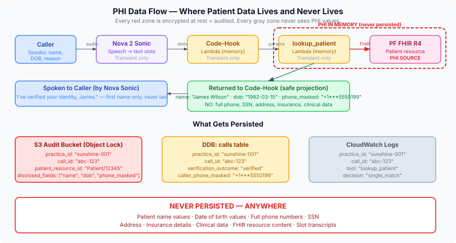

Every call touches PHI. Here's exactly what data flows where and what's
recorded.

### Data flow for a single verified call

```
┌──────────────────────────────────────────────────────────────────────────┐
│ DATA ELEMENT           │ WHERE IT GOES              │ LOGGED?           │
├────────────────────────┼────────────────────────────┼───────────────────┤
│ Caller's ANI           │ Connect (contact data)     │ Masked in calls   │
│ (+15555550199)         │ Router Lambda (DDB key)    │ table (+1***5199) │
│                        │ Rate-limit table (key)     │                   │
├────────────────────────┼────────────────────────────┼───────────────────┤
│ Caller's spoken name   │ Nova Sonic → Lex slots     │ NEVER logged      │
│ "James Wilson"         │ Code-hook Lambda (memory)  │ (slot values not  │
│                        │ lookup_patient (param)     │  persisted)       │
├────────────────────────┼────────────────────────────┼───────────────────┤
│ Caller's spoken DOB    │ Nova Sonic → Lex slots     │ NEVER logged      │
│ "1982-03-15"           │ Code-hook Lambda (memory)  │                   │
│                        │ lookup_patient (param)     │                   │
├────────────────────────┼────────────────────────────┼───────────────────┤
│ FHIR Patient resource  │ lookup_patient Lambda      │ Resource ID only  │
│ (name, DOB, phone,     │ (in memory, never stored)  │ in audit log.     │
│  address)              │                            │ Disclosed fields  │
│                        │ Code-hook gets: name,      │ list in audit.    │
│                        │ masked phone, DOB only     │ Never the values. │
├────────────────────────┼────────────────────────────┼───────────────────┤
│ Verification outcome   │ Connect contact attributes │ YES: calls table  │
│ (verified/failed)      │ calls DDB table            │                   │
├────────────────────────┼────────────────────────────┼───────────────────┤
│ Call recording + trans. │ S3 (KMS-CMK encrypted)     │ YES: encrypted    │
│                        │                            │ at rest           │
├────────────────────────┼────────────────────────────┼───────────────────┤
│ Audit record           │ S3 audit bucket            │ YES: Object Lock  │
│ (who accessed what     │ (compliance mode,          │ 7-year retention  │
│  and when)             │  KMS-CMK)                  │                   │
└────────────────────────┴────────────────────────────┴───────────────────┘
```

**CloudWatch logs contain:** practice_id, call_id, tool name, timing,
decision taken (single_match / no_match / error). **Never:** patient
name, DOB, phone number, FHIR resource content.

---

## Part 8: What's Not Built Yet (Honest Gap Analysis)

This section maps each user journey step to its implementation status.

| Journey step | Status | What exists | What's missing |
|---|---|---|---|
| Maria creates account (Cognito) | ❌ Not built | Cognito is in architecture doc | No CDK stack, no sign-up flow |
| Maria sees dashboard | ❌ Not built | React + Vite scaffolded | No pages, no API backend for call data |
| Dr. Patel authorizes FHIR | ✅ Built | OAuth routes, PKCE, token storage, Playwright test | Redirect URI needs real domain (Function URL is raw) |
| DID claimed at onboarding | ✅ Built | phone_routing_store.claim(), CDK stack deployed | Connect ClaimPhoneNumber call in callback is coded but not deploy-tested |
| Router Lambda resolves DID | ✅ Built | handler.py, 4 tests, CDK stack | Not deployed yet |
| Lex bot collects slots | ✅ Built (CDK) | lex-stack.ts with Nova 2 Sonic, 9 tests | Not deployed; needs deploy-time validation that Nova 2 Sonic model ARN works |
| Code-hook calls lookup_patient | ⚠️ Skeleton | handler.py delegates/stubs | Fulfillment path doesn't actually call Gateway yet |
| lookup_patient FHIR search | ✅ Built | handler.py, fhir_client.py, 53 tests, deployed to AWS | Gateway Lambda env vars are placeholders (empty strings) |
| Disambiguation (multiple matches) | ⚠️ Partial | lookup_patient returns multiple candidates | Code-hook doesn't implement the re-elicit flow yet |
| Verification result → Lex response | ⚠️ Skeleton | Code-hook returns stub message | Needs real verification logic mapping results to dialog actions |
| Post-verification JTBD tools | ❌ Not built | Architecture doc + JTBD doc define them | No Lambda code for lab_result_status, visit_summary, document_status |
| Transfer to human queue | ❌ Not built | Contact flow has disconnect only | Need queue resources in Connect + TransferContactToQueue action |
| After-hours handling | ❌ Not built | Architecture doc mentions it | No contact flow branching; no business_hours check |
| Dashboard call view | ❌ Not built | calls table schema defined | No API endpoints, no React pages |
| Alerts (token expired, etc.) | ❌ Not built | Architecture doc describes it | No CloudWatch alarms, no SNS topics |
| Call recording + transcript | ❌ Not built | S3 bucket deployed (audit stack) | Connect recording config not set up |

### Critical path to first real call

```
1. Wire code-hook fulfillment → lookup_patient (via Gateway)     [Session 0012]
2. Wire Gateway Lambda env vars to real DDB/KMS/S3 ARNs          [Session 0012]
3. Deploy all 7 stacks                                           [Session 0012]
4. Add TransferContactToQueue action for escalation               [Session 0012]
5. Configure Connect queues (verified + escalation)               [Session 0012]
6. Run one onboarding → test call → verify → answer/transfer      [Session 0012]
```

---

## Part 9: Unanswered Questions That Affect User Experience

These are things we don't know yet that will change how the call feels.

| Question | Impact | When to resolve |
|---|---|---|
| How does Nova 2 Sonic handle accents and background noise? | Slot collection accuracy; caller frustration | Deploy + test call |
| What happens when Lex can't parse a date? ("uh, March... wait, no, April fifteenth") | Retry prompt quality; how many retries before escalation | Deploy + test call |
| Does the `ConnectParticipantWithLexBot` action pass the Connect contact ID to Lex session? | Need it for audit log correlation (call_id) | Verify at deploy |
| How long does Nova 2 Sonic take to generate a response after the code-hook returns? | Total latency the caller perceives as "silence" | Measure at deploy |
| Does PF's FHIR endpoint have variable latency under load? | lookup_patient p99 might exceed Gateway's 30s timeout | Load test against PF QA |
| What voice does "Matthew" (Nova 2 Sonic) actually sound like? | Caller trust and comfort | Listen at first test call |
| Can we customize the Lex slot prompts to sound more natural with Nova Sonic? | "Could I get your first name?" vs a more conversational opener | Tune after first test |
| What happens to in-flight calls when we deploy a new Lex bot version? | Call drops during deployment | Test blue-green deploy |

---

*This document is the source of truth for "what does the user experience?"
The architecture doc is the source of truth for "how does the system work?"
The ADRs are the source of truth for "why did we choose this?" All three
must stay in sync.*
